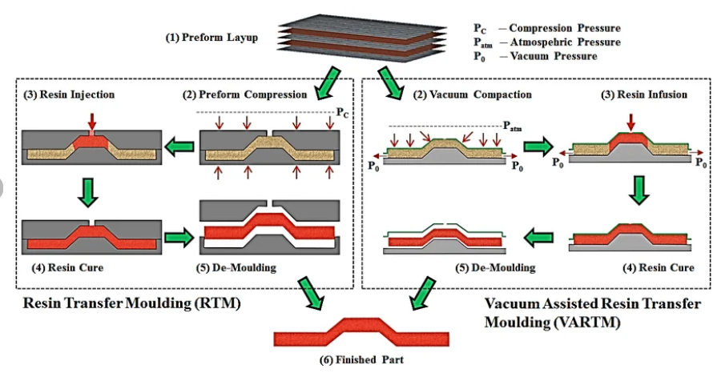

# RTMsim-Py

Python port of [RTMsim](https://github.com/obertscheiderfhwn/RTMsim) (Christof Obertscheider, FHWN) with additional features.
- RTM and VARI manufacturing processes simulation
- Shell mesh with stacked-laminate (Nastran BDF format)
- Every element carries the full ply stack through its thickness
- Only the fibre orientation differs from ply to ply
- Output: filling progress over time, pressure



## Physics summary

- **Governing equations:** compressible Euler + Darcy drag on 2-D shells, VOF filling factor γ ∈ [0, 1].
- **EOS:** adiabatic `p(ρ) = κ ρ^γ`, stabilised by a quadratic lookup-table fit through three reference points.
- **Gradient:** least-squares pressure gradient on cell-center neighbours (fast 2×2 normal-equations variant by default).
- **Flux:** first-order upwind, central ρ on face, upwinded velocity/γ.
- **Momentum update:** explicit pressure + convection, **implicit** Darcy drag with a full 2×2 inverse `−μ K⁻¹ u`.
- **Anisotropy:** per-element 2×2 in-plane permeability tensor `K` derived from the laminate stack (see below). The solver consumes `(Kxx, Kxy, Kyy)` directly — no diagonal-axis assumption.
`

Example:


## Install and run

```bash
pip install numpy matplotlib numba
python demo_stacks.py
```

