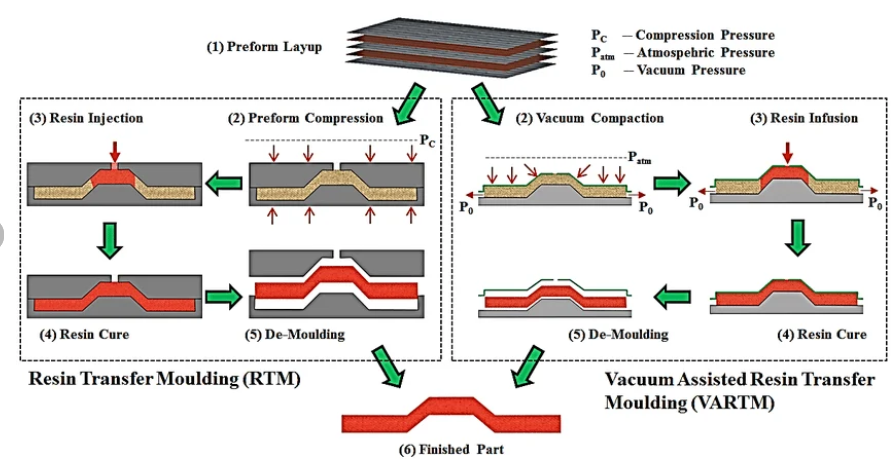
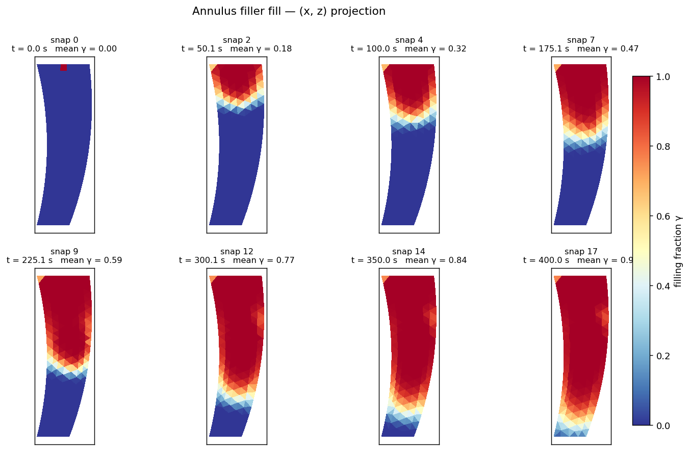

# RTMsim-Py

Python port of [RTMsim](https://github.com/obertscheiderfhwn/RTMsim) (Christof Obertscheider, FHWN) with additional features.
- RTM and VARI manufacturing processes simulation
- Shell mesh with stacked-laminate (Nastran BDF format)
- Every element carries the full ply stack through its thickness
- Only the fibre orientation differs from ply to ply
- Output: filling progress over time, pressure



## Physics summary

- **Governing equations:** compressible Euler + Darcy drag on 2-D shells, VOF filling factor γ ∈ [0, 1].
- **EOS:** adiabatic `p(ρ) = κ ρ^γ`, stabilised by a quadratic lookup-table fit through three reference points.
- **Gradient:** least-squares pressure gradient on cell-center neighbours (fast 2×2 normal-equations variant by default).
- **Flux:** first-order upwind, central ρ on face, upwinded velocity/γ.
- **Momentum update:** explicit pressure + convection, **implicit** Darcy drag with a full 2×2 inverse `−μ K⁻¹ u`.
- **Anisotropy:** per-element 2×2 in-plane permeability tensor `K` derived from the laminate stack (see below). The solver consumes `(Kxx, Kxy, Kyy)` directly — no diagonal-axis assumption.
`

Example:



## Install and run

```bash
pip install numpy matplotlib numba trimesh rtree
python demo_4ply.py        # RTM filling, 4-ply stack
python demo_lcm.py         # VARI (LCM) process
python demo_thermal.py     # thermal and cure
python mesh_annulusfiller.py

pip install pyvista mmgpy  # needed by the STL test only
python test_filling_frame.py   # STL shell, mmgs remesh, cascade ports, PyVista view
```

## API

All inputs are set through setters and results read through getters;
physical inputs have no built-in defaults (`RTMSimulation.validate()`
names anything missing). Numerical constants live in `SolverSettings`.

```python
import rtmsim as rtm

mesh = rtm.ShellMesh.from_stl("part.stl", scale=1e-3, units="mm")  # or from_trimesh / from_arrays
resin = rtm.ResinMaterial("epoxy").set_viscosity(0.1)
fabric = rtm.FabricMaterial("biax").set_permeability(3e-10, 6e-11).set_porosity(0.6)
stack = rtm.LaminateStack().add_ply(fabric, 0.75e-3, refdir=(1, 0, 0))

sim = (rtm.RTMSimulation()
       .set_mesh(mesh).set_process_model(1)
       .set_resin(resin).set_laminate(stack)
       .set_pressures(p_inlet=2e5, p_init=1e5)
       .set_air_eos(p_ref=1.01325e5, rho_ref=1.225, gamma=1.4)
       .set_run_control(tmax=600.0, n_pics=16)
       .add_injection_port((10.0, 0.0, 5.0), radius=5.0)                  # mesh units
       .add_injection_port((200.0, 0.0, 5.0), radius=5.0, t_activate=120)  # cascade port
       .add_vent((390.0, 0.0, 5.0), radius=5.0))
sim.run()
t_fill = sim.get_total_fill_time()
filled = sim.get_filled_mask_at(0.5 * t_fill)     # also: get_fill_time_field, get_fill_curve,
                                                   # get_pressure_at, get_pressure_results, ...
```

Ports are located by coordinates: the point is projected onto the surface
and every cell whose centre lies within `radius` becomes an inlet cell
(`add_injection_port_cells` takes explicit cell ids instead). Thermal and
cure runs add `set_thermal(...)`, `enable_cure()` and the resin/fabric
thermal, viscosity-model and cure-kinetics setters (see `demo_thermal.py`).

The time loop runs compiled (Numba) and the flow kernel is multi-threaded.
The thread count defaults to about one thread per 500 cells, capped at the
machine's thread count. Override it with
`sim.set_solver_settings(n_threads=8)`; results do not depend on it.

The solver needs a reasonably isotropic triangle mesh: raw CAD STL
tessellations (long flat triangles) make it diverge and should be
remeshed first, as `test_filling_frame.py` does with MMG (`mmgs`).

